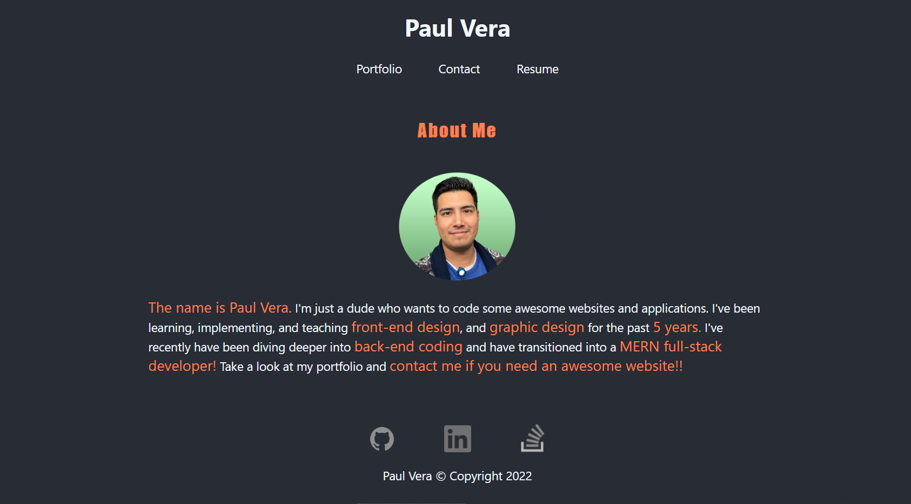

  # Portfolio-React
  

  ## Description
  This is a REACT.JS version of my portfolio. It showcases my knowledge in different coding languages as well as proficiencies in different aspects of web development.

  ## Table of Contents
  - [Installation](#installation)
  - [Questions](#questions)

  ## Installation
  Click on the link provided to view my portfolio! [Click Here](https://paulvera-portfolio.herokuapp.com)

  ## License
  License under  license

  ## Contributing
  Created with:
  * REACT.JS
  * JavaScript
  * CSS
  * A bit of HTML
  * Heroku Web Services
  
----
  ## Questions
  If you have questions, you can contact me below!
  
  GitHub Username: paul88vera

  GitHub Profile: [Github.com/paul88vera](https://github.com/paul88vera/)

  Email Address: paul88vera@gmail.com
 